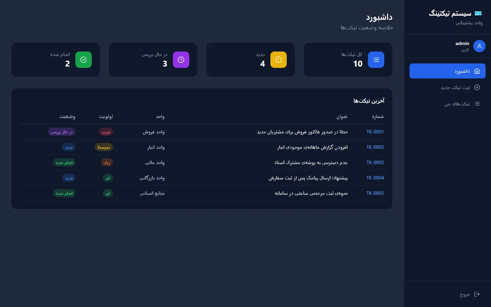
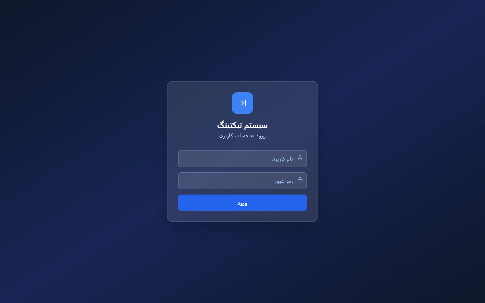
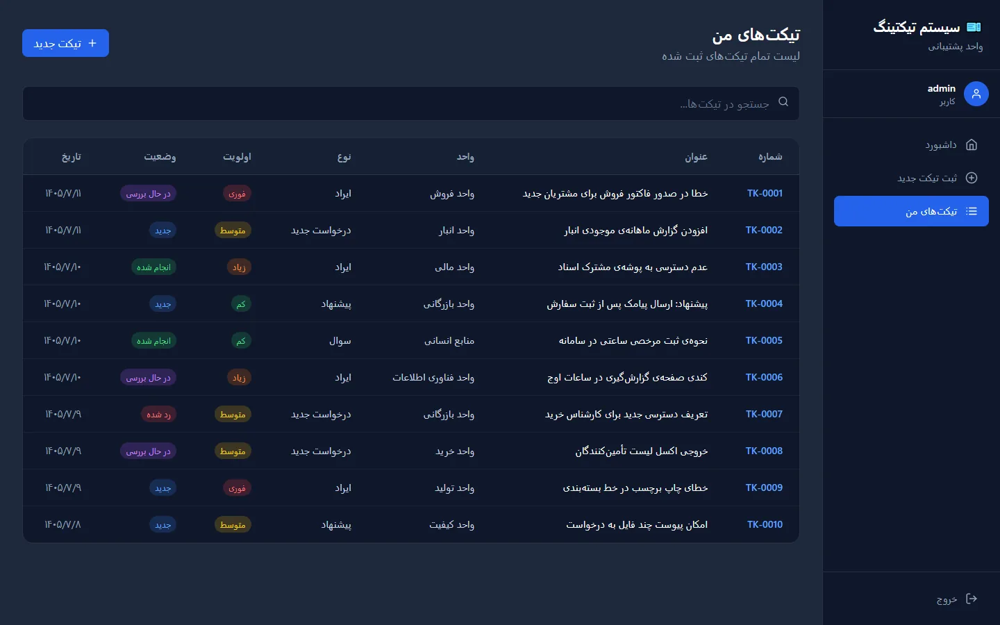
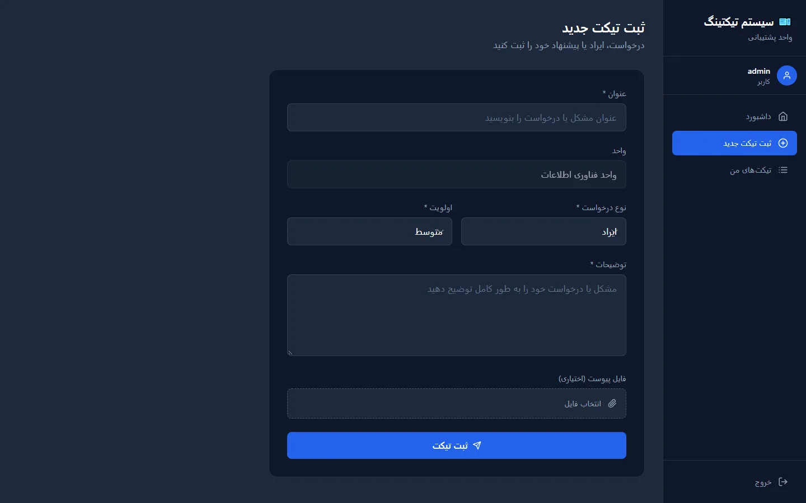
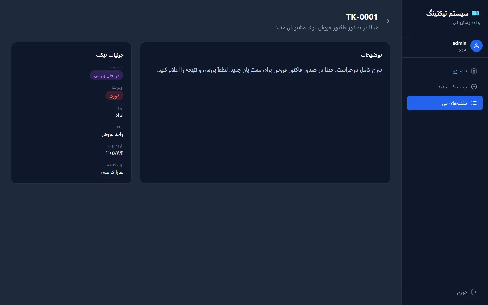

<div align="center">

# 🎫 Ticket Management System

**An internal support desk for organizations: submit, track and resolve requests from creation to closure.**

Django REST Framework · SQL Server · JWT · React · Tailwind CSS


<br>



</div>

---

## 📌 Overview

Support requests used to arrive through email, phone calls and chat apps. Nobody could see **who owned a request, what stage it was in, or how many were still open**, so reporting was practically impossible.

This system gives every request a **ticket number, type, priority and status**, and lets the support team follow it from submission to closure. Employees submit and follow their own tickets, while the support team sees everything on a status dashboard.

> **Result:** every request is traceable from submission to closure, and managers have a clear view of the workload.

## ✨ Features

| | |
|---|---|
| 🔐 **JWT authentication** | Access and refresh tokens with automatic refresh on expiry |
| 🏢 **Organization login** | Signs users in against the existing organizational user database (no separate accounts) |
| 👥 **Role-based visibility** | Employees see their own tickets; staff see all tickets |
| 🔢 **Automatic numbering** | Sequential IDs such as `TK-0001`, `TK-0002`, … |
| 🏷️ **Type, priority & status** | Bug / suggestion / feature request / question · low → urgent · new → reviewing → done / rejected |
| 📎 **Attachments** | Optional file upload on each ticket |
| 📊 **Status dashboard** | Totals per status and the latest tickets at a glance |
| 🔎 **Searchable list** | Filter tickets by number, title or unit |
| 🌐 **RTL Persian UI** | Responsive interface designed for Persian-speaking teams |
| 🛠️ **Django admin** | Manage tickets with filters and search out of the box |

## 📸 Screenshots

<table>
  <tr>
    <td width="50%"><b>Login</b><br></td>
    <td width="50%"><b>Dashboard</b><br></td>
  </tr>
  <tr>
    <td><b>My tickets</b><br></td>
    <td><b>New ticket</b><br></td>
  </tr>
  <tr>
    <td colspan="2"><b>Ticket details</b><br></td>
  </tr>
</table>

## 🏗️ Architecture

```text
┌──────────────────────┐   JWT (Bearer)   ┌───────────────────────────┐        ┌──────────────────┐
│ React + Tailwind     │ ───────────────▶ │ Django REST Framework     │ ─────▶ │ SQL Server       │
│ Dashboard · List ·   │   REST / JSON    │ Tickets API · JWT auth ·  │  ORM   │ Tickets          │
│ Details · New ticket │ ◀─────────────── │ Org-user auth backend     │ ◀───── │ Org user tables  │
└──────────────────────┘                  └───────────────────────────┘        └──────────────────┘
```

- **Backend:** Django REST Framework API on SQL Server (`mssql-django`), JWT via `djangorestframework-simplejwt`.
- **Auth:** a custom authentication backend validates credentials against the organization's existing user table and creates or updates a matching Django user on first login. The token response also includes the user's full name and organizational unit.
- **Frontend:** React (Create React App) with Tailwind CSS, React Router, Axios, Framer Motion and React Icons.

### Ticket model

| Field | Values |
|---|---|
| `ticket_number` | Auto-generated, e.g. `TK-0001` |
| `type` | `bug` · `suggestion` · `new_feature` · `question` |
| `priority` | `low` · `medium` · `high` · `urgent` |
| `status` | `new` · `reviewing` · `done` · `rejected` |
| `unit` | Organizational unit of the requester |
| `attachment` | Optional file |
| `created_by`, `created_at` | Set automatically |

## 🔌 API

| Method | Endpoint | Description |
|---|---|---|
| `POST` | `/api/token/` | Log in and get access/refresh tokens (plus `full_name`, `unit`) |
| `POST` | `/api/token/refresh/` | Get a new access token |
| `GET` | `/api/tickets/` | List tickets (own tickets, or all for staff) |
| `POST` | `/api/tickets/` | Create a ticket (multipart, supports attachment) |
| `GET` | `/api/tickets/{id}/` | Ticket details |
| `PUT` / `PATCH` | `/api/tickets/{id}/` | Update a ticket |
| `DELETE` | `/api/tickets/{id}/` | Delete a ticket |
| `GET` | `/api/users/?search=` | Username lookup used by the login form |

## 🚀 Getting started

### Prerequisites

- Python **3.12+**
- Node.js **18+**
- Microsoft SQL Server with **ODBC Driver 17 or 18 for SQL Server**

### 1. Clone

```bash
git clone https://github.com/erfanmohammadi1998/ticket-management-system.git
cd ticket-management-system
```

### 2. Backend

```bash
python -m venv venv
venv\Scripts\activate          # macOS/Linux: source venv/bin/activate
pip install -r requirements.txt
copy .env.example .env         # macOS/Linux: cp .env.example .env
```

Edit `.env` with your own secret key and SQL Server connection, then:

```bash
python manage.py migrate
python manage.py runserver
```

The API runs at `http://127.0.0.1:8000/api/`.

### 3. Frontend

```bash
cd frontend
npm install
npm start
```

The app opens at `http://localhost:3000`.

> **Integration note:** sign-in is wired to an existing organizational user database (`sec_users`, `Emp_Employee` and `Emp_UnitOrganizational` tables). To run the project elsewhere, provide equivalent tables or adapt `tickets/auth_backend.py` and `tickets/token_serializers.py` to your own user source.

## ⚙️ Configuration

All secrets and machine-specific settings live in `.env` (never committed). See [`.env.example`](.env.example).

| Variable | Description |
|---|---|
| `DJANGO_SECRET_KEY` | Django secret key (required) |
| `DJANGO_DEBUG` | `True` for development |
| `DJANGO_ALLOWED_HOSTS` | Comma-separated host names |
| `DB_NAME`, `DB_USER`, `DB_PASSWORD`, `DB_HOST`, `DB_PORT` | SQL Server connection |
| `DB_DRIVER` | ODBC driver name |
| `CORS_ALLOWED_ORIGINS` | Frontend origin(s), e.g. `http://localhost:3000` |

## 📁 Project structure

```text
ticket-management-system/
├── core/                    Django project (settings, URLs)
├── tickets/                 Tickets app
│   ├── models.py            Ticket model + automatic numbering
│   ├── views.py             Ticket API and user lookup
│   ├── serializers.py
│   ├── auth_backend.py      Organizational user authentication
│   └── token_serializers.py JWT response with name and unit
├── frontend/                React + Tailwind client
│   └── src/
│       ├── pages/           Login, Dashboard, TicketList, TicketDetail, NewTicket
│       ├── components/      Layout, Sidebar
│       ├── context/         AuthContext (JWT session)
│       └── services/api.js  Axios client with token refresh
├── docs/screenshots/
├── .env.example
├── requirements.txt
└── manage.py
```

## 🗺️ Roadmap

- [ ] Comments and conversation thread on tickets
- [ ] Email / in-app notifications on status changes
- [ ] Assigning tickets to support staff
- [ ] Reports and charts for managers
- [ ] Server-side filtering and pagination

## 📄 License

Released under the [MIT License](LICENSE).

## 👨‍💻 Author

**Erfan Mohammadi**

[](https://erfanmohammadi.ir/)
[](https://www.linkedin.com/in/erfan-mohammadi77/)
[](https://github.com/erfanmohammadi1998)

---

<div dir="rtl">

## 🇮🇷 خلاصه فارسی

**سامانه مدیریت تیکت پشتیبانی**: ثبت و پیگیری درخواست‌های پشتیبانی داخل سازمان، با گردش‌کار وضعیت و دسترسی مبتنی بر نقش.

**مسئله:** درخواست‌ها از ایمیل، تلفن و پیام‌رسان می‌رسید و مشخص نبود هر درخواست دست چه کسی است، در چه مرحله‌ای است و چند مورد باز مانده؛ گزارش‌گیری عملاً ممکن نبود.

**راه‌حل:** سامانه‌ای Full-Stack با Django REST Framework روی SQL Server که برای هر درخواست شماره خودکار، نوع، اولویت و وضعیت ثبت می‌کند. فرانت‌اند React با داشبورد وضعیت، لیست قابل جستجو، صفحه جزئیات و فرم ثبت تیکت.

**امکانات:** احراز هویت JWT و ورود با کاربران سازمان · شماره‌گذاری خودکار تیکت‌ها · نوع، اولویت و وضعیت · فایل پیوست · داشبورد وضعیت · جستجو در تیکت‌ها · رابط کاربری فارسی و راست‌به‌چپ

**نتیجه:** هر درخواست از ثبت تا بستن قابل ردیابی است و مدیران دید روشنی از وضعیت کارها دارند.

</div>
